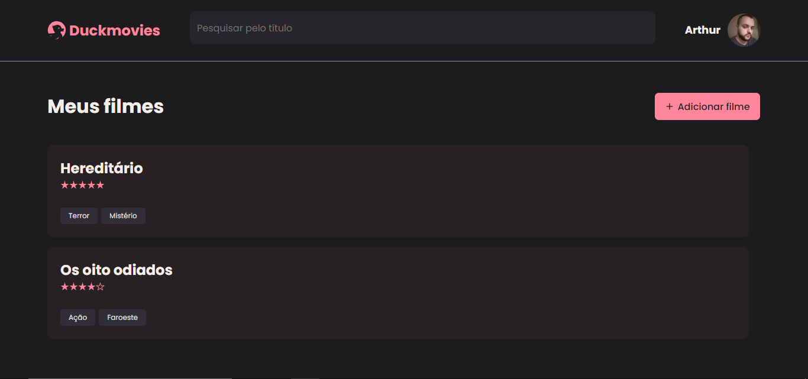
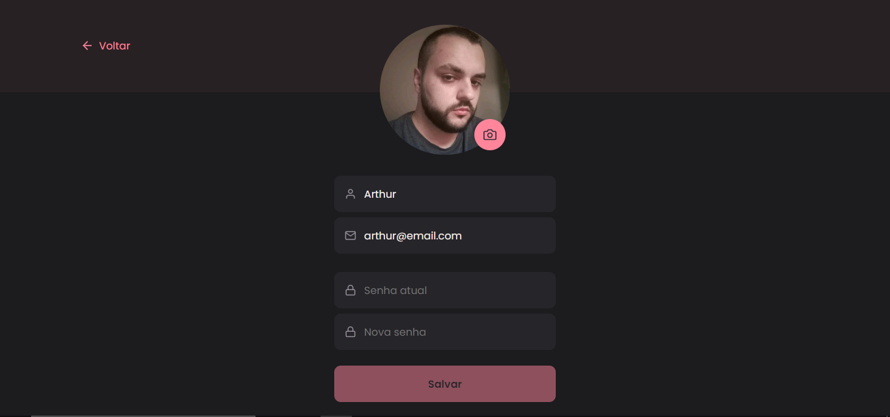
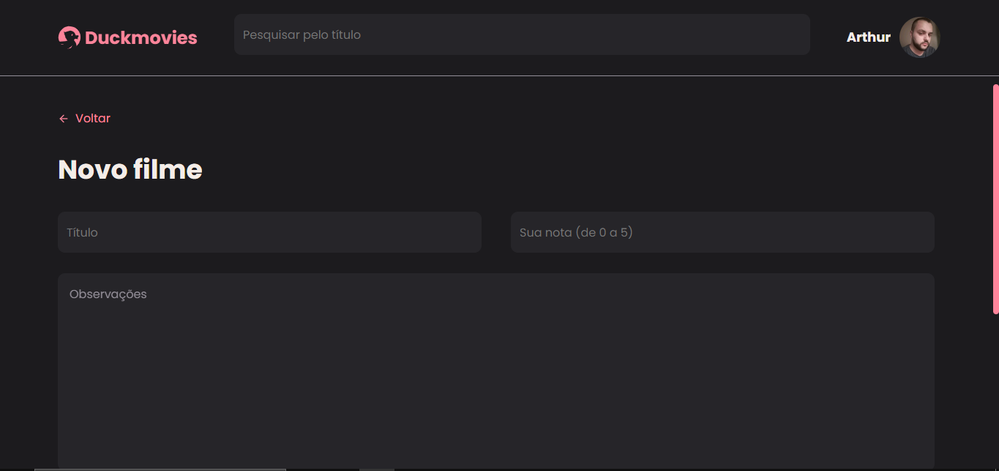
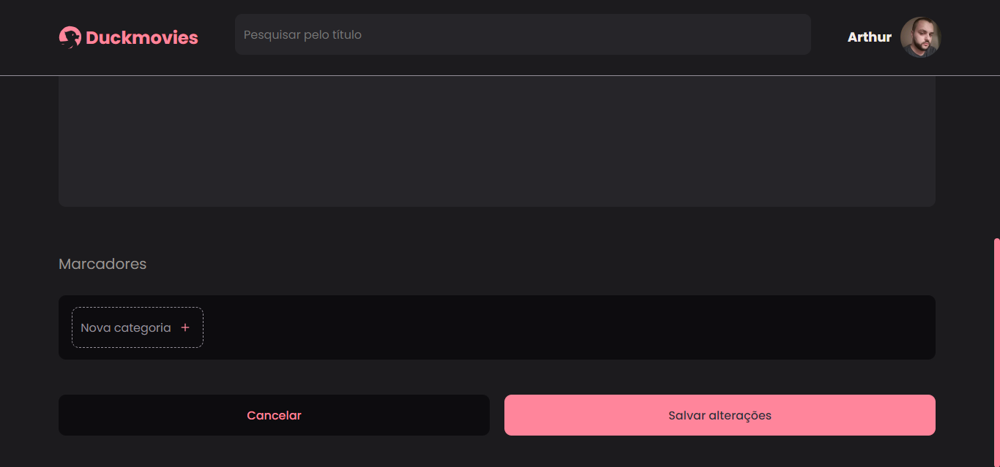
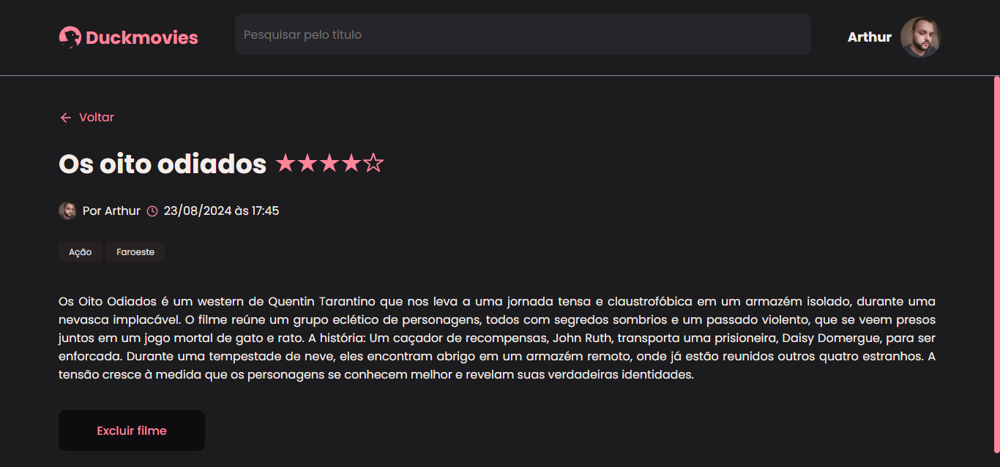

# Front-end Duckmovies 

Duckmovies é uma aplicação para gerenciar anotações e classificações de filmes. Permite que os usuários autenticados criem e visualizem suas notas de filmes, e explorem uma interface moderna e intuitiva.

## Deploy da aplicação
A aplicação Duckmovies está disponível online e pode ser acessada através do seguinte link:
- [Duckmovies - Acesse a aplicação](https://duckmovies.netlify.app/)
> 💡 **Observação:** Para testar a aplicação, é necessário deixar o backend rodando juntamente com a aplicação web (igual mostrada em vídeo).

https://github.com/user-attachments/assets/574cd24e-99f7-4687-bc5d-cdab5c86de33


## Telas da aplicação
Abaixo estão algumas capturas de tela das principais páginas da aplicação Duckmovies:

| Login         | Registro         | Home        |
|-----------------------|--------------------------|------------------------|
|   |  |  |

| Perfil         | Criação de Filme 1       | Criação de Filme 2      |
|-----------------------|--------------------------|------------------------|
|   |  |  |

| Visualização do Filme |
|-----------------------|
|  |

## Licença

- Este projeto está licenciado sob a licença MIT - veja o arquivo [LICENCE](./LICENSE) para detalhes.

## Tecnologias utilizadas:

- **React.js**: Biblioteca para construir interfaces de usuário interativas.
- **Material UI**: Biblioteca de componentes React para construir uma interface visualmente agradável e responsiva.
- **Zod**: Biblioteca para validação de esquemas de dados.
- **Vitest**: Ferramenta de teste para realizar testes unitários e de integração.
- **Testing Library**: Biblioteca para testar componentes React e simular interações com eles.

## Funcionalidades:

- **Autenticação de Usuários**: Registre-se e faça login para acessar e gerenciar suas notas de filmes de forma segura.
- **Criação e Visualização de Notas**: Adicione anotações detalhadas sobre filmes, incluindo avaliações e tags personalizadas, e visualize suas notas em uma interface organizada.
- **Classificação de Filmes**: Avalie filmes utilizando um sistema de classificação por estrelas para expressar suas opiniões de maneira intuitiva.

## Documentação da API:

A aplicação interage com a API para gerenciar dados de filmes e notas. Para mais detalhes, consulte a [documentação da API](https://duckmovies-backend.onrender.com/api-docs/).

## Instalação

1. Clone o repositório:

```
git clone https://github.com/Artspessoto/Duckmovies-web.git
```

2. Navegue até o diretório do projeto:

```
cd Duckmovies-web
```

3. Instale as dependências:

```
npm ci
```

4. Inicie o servidor de desenvolvimento:

```
npm run dev
```

## Testes

Para rodar os testes do projeto, use o comando:

```
npm run test
```

## Links Úteis

- [Repositório Backend](https://github.com/Artspessoto/Duckmovies-backend)
- [Material UI Documentation](https://mui.com/)
- [Zod Documentation](https://zod.dev/)
